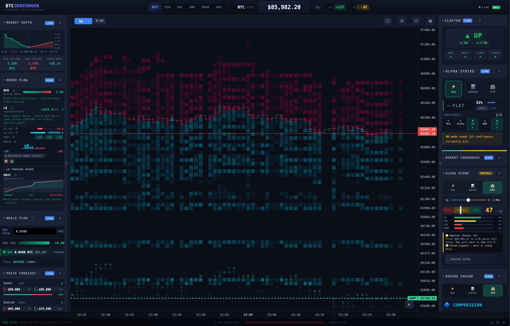
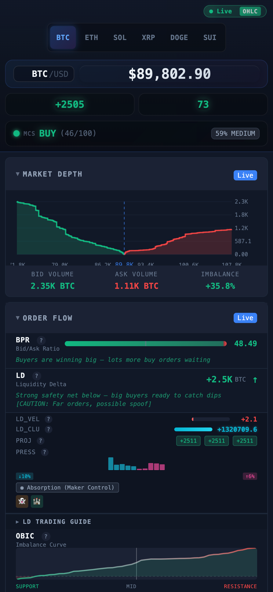

# Synthetic Order Book

A real-time, multi-exchange cryptocurrency order book visualization and analysis tool. Aggregates order book data from Kraken, Coinbase, and Bitstamp via WebSocket connections to provide institutional-grade market insights.

  

> ⚠️ **BETA SOFTWARE** - This project is under active development and changes daily as research and new features are implemented. Expect frequent updates, breaking changes, and evolving functionality. Use at your own discretion.

## 📸 Screenshots

### Desktop View


### Mobile View
<p align="center">
  
</p>

## 🔗 Quick Links

- **[Live Demo](https://deboorn.github.io/synthetic-order-book/)** - GitHub Pages deployment

---

## 📋 Table of Contents

1. [Features](#features)
2. [Understanding the Interface](#understanding-the-interface)
3. [Output Reference Guide](#output-reference-guide)
   - [Cluster Signal Panel](#9-cluster-signal-panel)
   - [Alpha Strike Panel](#10-alpha-strike-panel)
   - [Trade Simulators](#17-trade-simulators)
4. [Installation](#installation)
5. [Coinbase Advanced Trading](#coinbase-advanced-trading)
6. [Configuration](#configuration)
7. [Alerts](#alerts)
8. [License](#license)

---

## ✨ Features

- **Multi-Exchange Aggregation** - Real-time data from Kraken, Coinbase, Bitstamp
- **WebSocket-Only Architecture** - No backend required, runs entirely in browser
- **Market Depth Visualization** - Cumulative bid/ask volume chart
- **Order Book Imbalance Curve (OBIC)** - Proprietary imbalance analysis
- **Liquidity Delta Analysis** - Institutional flow detection
- **Multi-Timeframe Consensus** - MM, Swing, and HTF perspectives
- **Cluster Signal Panel** - Combined prox/drift signals from locked and live candle states with confluence dots
- **Alpha Strike Panel** - Confluence-based directional signals with MM/Swing/HTF trading modes
- **Trade Simulators (x8)** - Paper trading with signal-based entries, per-symbol tracking, and persistence across page refresh
- **Support/Resistance Levels** - Auto-detected from order book clusters
- **Trade Footprint Heatmap** - Real-time delta visualization of actual trades per price level
- **Levels Heatmap** - Historical order book cluster visualization on chart
- **Historical Klines** - Via Binance Vision API (CORS-friendly)
- **TradingView-style Alerts** - Browser notifications + sound for key metrics (one time / once per bar / once per minute)
- **Multi-Symbol Support** - BTC, ETH, SOL with independent state per symbol

---

## 🔔 Alerts

Alerts are **client-side only** (no server). You can create alerts from:

- Any panel header **bell icon**
- The chart header **“Create chart alert”** button (price / mid / VWMP / IFV / EMA / ZEMA, etc.)

**Alert frequency modes:**

- **One time** (auto-disables after firing once)
- **Once per bar** (uses the active chart timeframe candle boundary)
- **Once per minute** (repeats while condition remains true)

**Delivery:**

- **Browser notifications** (requires permission)
- **Sound** (select from built-in sounds or WAV files in `order-book/sounds/`)

**Important:** Since this is a browser app, the tab must stay **open/active** for alerts to work reliably.

---

## 🖥️ Understanding the Interface

### Layout Overview

```
┌─────────────────────────────────────────────────────────────────────────────┐
│  BTC ORDERBOOK          BTC/USD   $92,165.90  [LIVE]        ⚙ Live [OHLC] ⟳ │
├───────────────┬─────────────────────────────────────┬───────────────────────┤
│ ▼ MARKET DEPTH│                                     │ ▼ MARKET CONSENSUS    │
│   [Live]      │      [4h ▼]  6h 53m    ⓘ ⚙        │                       │
│    ╱╲         │  ┌─────────────────────────────┐   │   ┌─────────────────┐ │
│   ╱  ╲        │  │ ▓▓▓▓▓░░░░░░░░░▓▓▓▓▓▓▓▓▓▓▓▓ │   │   │  WAIT/NEUTRAL   │ │
│  ╱    ╲       │  │ ▓▓▓▓▓▓░░░░░░░▓▓▓▓▓▓▓▓▓▓▓▓▓ │ ← │   └─────────────────┘ │
│ ╱      ╲      │  │ ▓▓▓▓▓▓▓░░░░░▓▓▓▓▓▓▓▓▓▓▓▓▓▓ │   │   MM   ████░░ (+40)   │
│ BID    ASK    │  │ ▓▓▓▓▓▓▓▓░░░▓▓▓▓▓▓▓▓▓▓▓▓▓▓▓ │   │   Swing ███░░░ (-20)  │
│ 2,461  1,355  │  │     ░░░ ██████ ░░░          │   │   HTF   ██░░░░ (-20)  │
│ IMBALANCE     │  │     ░░ █ ▓▓▓▓ █ ░░          │   │                       │
│   +29.0%      │  │ ────── ██████ 92,165 ────── │   │ ▼ MM (Microstructure) │
├───────────────┤  │     ████▓▓▓▓███████        │   │   Order Flow: LD +24  │
│ ▼ ORDER FLOW  │  │     ███████████████        │   │   BPR: 1.01           │
│   [Live]      │  └─────────────────────────────┘   │                       │
│ BPR     1.01  │  │ ▼ 78.66 BTC   94990.50     │   │ ▼ Swing (Short-term)  │
│ ████████░░░░  │  │ ▲ 40.60 BTC   92250.69     │   │   Alpha: 50/100       │
│               │  │ ▼ 95.52 BTC   92180.47     │   │   +14.72% vs IFV      │
│ LD    +26.7   │  │ ▲ 80.75 BTC   92043.49     │   │                       │
│ Liquidity ↑   │  │ ▼ 22.06 BTC   91888.71     │   │ ▼ HTF (Macro)         │
├───────────────┤  └─────────────────────────────┘   │   Regime: MEAN REV    │
│ LD_VEL  -87.1 │                                     │   VWMP: $115,385      │
│ LD_CLU +2.1M  │  Chart Overlays:                    │                       │
│ PROJ +22/+39/+16 [✓] Trade Footprint Heatmap       │ ● WAIT / SCALP ONLY   │
├───────────────┤  [✓] Levels Heatmap                 ├───────────────────────┤
│ ▼ LD TRADING  │  [✓] Support/Resistance Levels     │ ▼ Key Levels          │
│   GUIDE       │  [ ] Mid / IFV / VWMP Lines        │ [All] [Bid] [Ask]     │
│               │                                     │ ▼ 78.66  94990.50    │
│ ⚠ WHAT'S      │  Heatmap Legend:                   │ ▲ 40.60  92250.69    │
│   HAPPENING   │  ░░░ = Support clusters (cyan)     │ ▼ 95.52  92180.47    │
├───────────────┤  ▓▓▓ = Resistance clusters (mag)   │ ▲ 80.75  92043.49    │
│ ▼ OBIC        │  ███ = Buy delta (green)           │ ▼ 22.06  91888.71    │
│     ╱╲        │  ░░░ = Sell delta (red)            │                       │
│ ___╱  ╲___    │                                     │                       │
│ SUP  MID RES  │                                     │                       │
├───────────────┴─────────────────────────────────────┴───────────────────────┤
│ ● Live  29KB  12:10 PM │ © 2025 Daniel Boorn · NFA · Use at Own Risk · v1.0  │
└─────────────────────────────────────────────────────────────────────────────┘
```

---

## 📊 Output Reference Guide

### 1. Price Header

```
┌─────────────────────────────────────────────────────────────────┐
│  BTC ORDERBOOK       BTC/USD  $92,165.90  [LIVE] ▲    ⚙ [OHLC] │
│  ─────────────       ───────  ──────────  ────── ─    ───────  │
│  App Title           Pair     Price       Status Dir  Controls │
└─────────────────────────────────────────────────────────────────┘
```

| Element | Description |
|---------|-------------|
| **BTC/USD** | Trading pair indicator |
| **$XX,XXX.XX** | Current aggregated price from exchanges |
| **LIVE** | Green badge = WebSocket connected |
| **▲/▼** | Price direction indicator (green up, red down) |

---

### 2. Market Depth Panel

#### Depth Chart - Valley Shape Visualization

```
         BIDS (Green)              ASKS (Red)
              │                        │
    2,500 ────┼────────────────────────┼────
              │█                      █│
    2,000 ────┼██                    ██│────
              │███                  ███│
    1,500 ────┼████                ████│────
              │█████              █████│
    1,000 ────┼██████            ██████│────
              │███████          ███████│
      500 ────┼████████        ████████│────
              │█████████      █████████│
        0 ────┼──────────╲  ╱──────────│────
              │           ╲╱           │
              └───────────┼────────────┘
                      MID PRICE
                      $92,165

    ◄── Price decreases    Price increases ──►
```

**How to Read:**
- Valley center = current market price
- Green area grows LEFT = cumulative buy orders below price
- Red area grows RIGHT = cumulative sell orders above price
- Steeper slope = more liquidity concentrated near price
- Wider base = liquidity spread across price range

#### Depth Statistics

```
┌─────────────────────────────────┐
│  BID VOLUME      ASK VOLUME     │
│   2,461.05        1,355.89      │
│     BTC             BTC         │
│                                 │
│       IMBALANCE: +29.0%         │
│       ████████████░░░░░         │
└─────────────────────────────────┘
```

| Metric | Description | Interpretation |
|--------|-------------|----------------|
| **BID VOLUME** | Total buy-side liquidity (BTC) | Higher = stronger support |
| **ASK VOLUME** | Total sell-side liquidity (BTC) | Higher = stronger resistance |
| **IMBALANCE** | (Bids - Asks) / Total × 100% | +% = bullish, -% = bearish |

**Imbalance Scale:**
```
-50%        -20%    -5%   0   +5%    +20%        +50%
  │           │      │    │    │      │           │
  ▼           ▼      ▼    │    ▼      ▼           ▼
STRONG    BEARISH  MILD   │  MILD  BULLISH    STRONG
BEARISH            BEAR   │  BULL             BULLISH
                       NEUTRAL
```

---

### 3. Order Flow Panel

#### BPR (Bid/Ask Pressure Ratio)

```
┌─────────────────────────────────┐
│  BPR                            │
│  Bid/Ask Ratio        1.01     │
│  ██████████████░░░░░░░░░░░░░   │
│  ◄── Sells    │    Buys ──►    │
│             BALANCED            │
└─────────────────────────────────┘

Formula: BPR = Total Bid Volume / Total Ask Volume

   0.5     0.7     0.9  1.0  1.1     1.5     2.0
    │       │       │    │    │       │       │
    ▼       ▼       ▼    │    ▼       ▼       ▼
  STRONG  MODERATE MILD  │  MILD  MODERATE STRONG
  SELLING SELLING  SELL  │  BUY   BUYING   BUYING
                      NEUTRAL
```

#### LD (Liquidity Delta)

```
┌─────────────────────────────────┐
│  LD                             │
│  Liquidity Delta    +26.7 BTC ↑│
│                                 │
│  Near-price bids vs asks        │
│  (within ±2% of current price)  │
└─────────────────────────────────┘

Formula: LD = Near Bids - Near Asks

    -100      -50       0       +50      +100
      │        │        │        │        │
   ───┼────────┼────────┼────────┼────────┼───
      │        │        │        │        │
    STRONG   MODERATE   │    MODERATE  STRONG
    SELLING  SELLING    │    BUYING    BUYING
                     NEUTRAL
                        ↑
                   +26.7 (mild bullish)
```

#### LD_VEL (Liquidity Delta Velocity)

```
┌─────────────────────────────────┐
│  LD_VEL             -87.1      │
│  ██████░░░░░░░░░░░░░░░░░░░░░░  │
│                                 │
│  Rate of LD change over time    │
│  (momentum acceleration)        │
└─────────────────────────────────┘

Interpretation:
  +100 ──► Rapid increase in buy pressure
     0 ──► Stable, no momentum change
  -100 ──► Rapid increase in sell pressure
```

#### LD_CLU (Liquidity Delta Cumulative)

```
┌─────────────────────────────────┐
│  LD_CLU          +2,175,836.7  │
│  ████████████████████████████░ │
│                                 │
│  Running total of LD changes    │
│  Shows institutional flow       │
└─────────────────────────────────┘

Trend Analysis:
  ╱ Rising  = Sustained accumulation (bullish)
  ╲ Falling = Sustained distribution (bearish)
  ─ Flat    = No clear institutional bias
```

#### PROJ (Projection Scores)

```
┌─────────────────────────────────┐
│  PROJ         +22   +39   +16  │
│               ───   ───   ───  │
│              Short  Med  Long  │
│              (±5%) (±15%)(±30%)│
│                                 │
│  [+22] [+39] [+16]             │
│   ██    ███   ██               │
└─────────────────────────────────┘

Score Scale:
  -100 ────── -50 ────── 0 ────── +50 ────── +100
    │          │         │          │          │
  STRONG    MODERATE  NEUTRAL   MODERATE   STRONG
  BEARISH   BEARISH             BULLISH    BULLISH
```

#### Absorption & Pressure Indicators

```
┌─────────────────────────────────┐
│  PRESS                          │
│  ▄▄▄▄▄▄▄▄▄▄▄▄▄▄▄▄▄▄▄▄▄▄▄▄▄▄▄   │
│  ░░░░░░░░░░░░░░░░░░░░░░░░░░░   │
│  ▀▀▀▀▀▀▀▀▀▀▀▀▀▀▀▀▀▀▀▀▀▀▀▀▀▀▀   │
│  -10%              0%       +10%│
│                                 │
│  ● Absorption (Maker Control)   │
│  ▲ Aggressive bid stacking      │
└─────────────────────────────────┘

Signals:
  ● Absorption      = Large orders absorbing aggression
  ▲ Bid stacking    = Buyers building walls (bullish)
  ▼ Ask stacking    = Sellers building walls (bearish)
  ⊟ Bid removal     = Support pulled (hidden bearish)
  ⊞ Ask removal     = Resistance pulled (hidden bullish)
```

---

### 4. LD Trading Guide

```
┌─────────────────────────────────┐
│ ▼ LD TRADING GUIDE              │
├─────────────────────────────────┤
│ 📰 WHAT'S HAPPENING             │
│                                 │
│ Order flow is balanced (LD:     │
│ +26.7 BTC). Velocity and        │
│ clusters conflict - unclear     │
│ who's really in control.        │
│                                 │
├─────────────────────────────────┤
│ 📋 WHAT TO DO                   │
│                                 │
│ ⬜ Chop zone - wait for clarity.│
│ Don't force trades in either    │
│ direction. Scalp only if you    │
│ must, with tight stops.         │
│                                 │
├─────────────────────────────────┤
│ 🎯 KEY FLOW ZONES               │
│                                 │
│ Range support:  $84,874.37      │
│ Range resistance: $99,635.14    │
│                                 │
├─────────────────────────────────┤
│ 🟡 NEWBIE TAKEAWAY              │
│                                 │
│ "Neither buyers nor sellers are │
│ winning. Best to wait - don't   │
│ trade when it's this unclear."  │
└─────────────────────────────────┘

Traffic Light System:
  🟢 Green  = Generally bullish, favor longs
  🟡 Yellow = Uncertain, scalp only or wait
  🔴 Red    = Generally bearish, favor shorts
```

---

### 5. OBIC (Order Book Imbalance Curve)

```
┌─────────────────────────────────┐
│ OBIC - Imbalance Curve          │
│                                 │
│        │    ╱╲                  │
│        │   ╱  ╲                 │
│        │  ╱    ╲                │
│   0 ───┼─╱──────╲───────────    │
│        │╱        ╲              │
│        ╱          ╲             │
│       ╱│           ╲            │
│      ╱ │            ╲           │
│     ╱  │             ╲          │
│ ───────┼───────────────────     │
│  SUPPORT    MID    RESISTANCE   │
│  (green)          (red)         │
└─────────────────────────────────┘

Formula: OBIC(price) = Σ Bids Below - Σ Asks Above

Reading the Curve:
  ╱ Above zero line = More cumulative bids = Bullish
  ╲ Below zero line = More cumulative asks = Bearish
  ╳ Zero crossing   = Equilibrium (fair value)

  Steep ╱ = Strong buying interest at that price
  Steep ╲ = Strong selling interest at that price
```

---

### 6. Main Chart

#### Candlestick + Levels Visualization

```
                              ▼ 78.66 BTC  94990.50
                         ═══════════════════════════ (resistance)
     95,000 ─────────────────────────────────────────
              │                          │
              │    ┌───┐                 │
     94,500 ──│────│   │─────────────────│───────────
              │    │   │    ┌───┐        │
              │    │ █ │    │   │        │
     94,000 ──│────│ █ │────│ █ │────────│───────────
              │    │ █ │    │ █ │  ┌───┐ │
              │    └─┬─┘    │ █ │  │   │ │
     93,500 ──│──────│──────│ █ │──│ █ │─│───────────
              │      │      └─┬─┘  │ █ │ │
                                   └─┬─┘
                         ═══════════════════════════ (support)
                              ▲ 40.60 BTC  92250.69

Legend:
  ┌───┐
  │ █ │ = Bullish candle (green) - Close > Open
  │   │
  └───┘

  ┌───┐
  │   │ = Bearish candle (red) - Close < Open
  │ █ │
  └───┘

  │    = Wick (high/low range)
  
  ═══  = Support/Resistance level
         Cyan = Support (bid cluster)
         Magenta = Resistance (ask cluster)
         Opacity = Volume strength
         Thickness = Significance
```

#### Level Labels

```
Right-side labels:
┌──────────────────────────┐
│ ▼ 78.66 BTC   94990.50   │  ← Red ▼ = Resistance (ask cluster)
│ ▲ 40.60 BTC   92250.69   │  ← Green ▲ = Support (bid cluster)
│ ▼ 95.52 BTC   92180.47   │
│ ▲ 80.75 BTC   92043.49   │
│        Mid    92165.90   │  ← Gray = Current price
│ ▼ 22.06 BTC   91888.71   │
└──────────────────────────┘
    ▲        ▲       ▲
    │        │       │
  Type    Volume   Price
```

---

### 7. Trade Footprint Heatmap

The Trade Footprint Heatmap visualizes **actual executed trades** aggregated by price level, showing where buying and selling pressure occurs within each candle.

```
┌─────────────────────────────────────────────────────────────────────────────┐
│  TRADE FOOTPRINT HEATMAP - Real-time Delta Visualization                    │
├─────────────────────────────────────────────────────────────────────────────┤
│                                                                             │
│   Time →      │ Bar 1 │ Bar 2 │ Bar 3 │ Bar 4 │ Bar 5 │                    │
│               ├───────┼───────┼───────┼───────┼───────┤                    │
│  $95,200 ─────│       │  ▓▓▓  │       │       │  ░░   │  ← Ask pressure    │
│  $95,150 ─────│       │  ▓▓   │       │  ░    │  ░░░  │                    │
│  $95,100 ─────│  ░░   │  ░    │  ███  │  ██   │  ░    │  ← Mixed           │
│  $95,050 ─────│  ░░░  │       │  ████ │  ███  │       │                    │
│  $95,000 ─────│  ████ │  ██   │  ███  │  ████ │  ██   │  ← Bid pressure    │
│  $94,950 ─────│  ███  │  ██   │  ░░   │  ███  │  ███  │                    │
│  $94,900 ─────│  ██   │       │  ░    │  ██   │  ████ │                    │
│               └───────┴───────┴───────┴───────┴───────┘                    │
│                                                                             │
│   Legend:                                                                   │
│   ████ = Strong BUY delta (green)  - More aggressive buyers                │
│   ██   = Moderate BUY              - Net buying pressure                   │
│   ░░░░ = Strong SELL delta (red)   - More aggressive sellers               │
│   ░░   = Moderate SELL             - Net selling pressure                  │
│   (opacity indicates intensity)                                            │
└─────────────────────────────────────────────────────────────────────────────┘
```

#### How It Works

```
┌──────────────────────────────────────────────────────────────┐
│                   TRADE DELTA CALCULATION                     │
├──────────────────────────────────────────────────────────────┤
│                                                               │
│   For each price bucket ($5/$10/$25/$50/$100 configurable):  │
│                                                               │
│   Delta = Σ(Buy Volume) - Σ(Sell Volume)                     │
│                                                               │
│   Example at $95,000 bucket:                                 │
│   ┌────────────────────────────────────────────────┐         │
│   │ Trades in bar:                                 │         │
│   │   Buy  2.5 BTC @ $95,010  ─┐                  │         │
│   │   Buy  1.2 BTC @ $95,005   │ Total Buy: 4.5   │         │
│   │   Buy  0.8 BTC @ $94,998  ─┘                  │         │
│   │   Sell 1.5 BTC @ $95,015  ─┐                  │         │
│   │   Sell 0.5 BTC @ $94,990  ─┘ Total Sell: 2.0 │         │
│   │                                               │         │
│   │   Delta = 4.5 - 2.0 = +2.5 (Green)           │         │
│   └────────────────────────────────────────────────┘         │
│                                                               │
└──────────────────────────────────────────────────────────────┘
```

#### Configuration

```
┌─────────────────────────────────────────┐
│  Trade Footprint Settings               │
├─────────────────────────────────────────┤
│  [✓] Trade Footprint Heatmap            │
│                                         │
│  Bucket Size: [▼ $10 ]                  │
│   ├─ $5   (fine detail)                 │
│   ├─ $10  (default)                     │
│   ├─ $25  (moderate)                    │
│   ├─ $50  (coarse)                      │
│   └─ $100 (broad view)                  │
└─────────────────────────────────────────┘
```

| Setting | Description |
|---------|-------------|
| **Bucket Size** | Price range per cell. Smaller = finer detail, larger = broader view |
| **Toggle** | Enable/disable the overlay on main chart |

---

### 8. Levels Heatmap (Order Book Cluster History)

The Levels Heatmap shows **historical order book clusters** (support/resistance) over time, revealing how liquidity walls evolve and move.

```
┌─────────────────────────────────────────────────────────────────────────────┐
│  LEVELS HEATMAP - Order Book Cluster History                                │
├─────────────────────────────────────────────────────────────────────────────┤
│                                                                             │
│   Time →      │Bar 1│Bar 2│Bar 3│Bar 4│Bar 5│Bar 6│Bar 7│Bar 8│           │
│               ├─────┼─────┼─────┼─────┼─────┼─────┼─────┼─────┤           │
│  $96,000 ─────│ ▓▓▓ │ ▓▓▓ │ ▓▓  │     │     │     │     │     │ RESISTANCE│
│  $95,500 ─────│ ▓▓  │ ▓▓▓ │ ▓▓▓ │ ▓▓  │     │     │     │     │ (Magenta) │
│  $95,000 ─────│     │ ▓   │ ▓▓  │ ▓▓▓ │ ▓▓▓ │ ▓▓  │ ▓   │     │ ← Moving  │
│               │     │     │     │     │     │     │     │     │   Wall    │
│  $93,500 ─────│     │     │     │ ░   │ ░░  │ ░░░ │ ░░░ │ ░░  │ ← Moving  │
│  $93,000 ─────│     │     │ ░   │ ░░  │ ░░░ │ ░░░ │ ░░  │ ░░  │   Support │
│  $92,500 ─────│ ░░  │ ░░  │ ░░░ │ ░░░ │ ░░  │ ░   │     │     │ SUPPORT   │
│  $92,000 ─────│ ░░░ │ ░░░ │ ░░  │ ░   │     │     │     │     │ (Cyan)    │
│               └─────┴─────┴─────┴─────┴─────┴─────┴─────┴─────┘           │
│                                                                             │
│   ▲ Shows liquidity walls moving UP over time (bullish pressure)           │
│                                                                             │
│   Legend:                                                                   │
│   ░░░ = Strong Support (large bid clusters)    - Cyan                      │
│   ▓▓▓ = Strong Resistance (large ask clusters) - Magenta                   │
│   (opacity = cluster volume relative to max)                               │
└─────────────────────────────────────────────────────────────────────────────┘
```

#### Reading the Heatmap

```
┌─────────────────────────────────────────────────────────────────────────────┐
│                        LEVEL HEATMAP PATTERNS                               │
├─────────────────────────────────────────────────────────────────────────────┤
│                                                                             │
│  PATTERN 1: Walls Moving Up (Bullish)                                       │
│  ─────────────────────────────────────                                      │
│  Time →   1   2   3   4   5                                                 │
│  $100 ────░───░───▓▓▓─▓▓▓─▓▓▓── ← Resistance chasing price up              │
│  $99  ────░───▓▓▓─▓───────────                                              │
│  $98  ────▓▓▓─▓────────────── ← Previous resistance absorbed               │
│  $96  ────░░░─░░░─░░░─░──────                                               │
│  $95  ────────────░░░─░░░─░░░── ← Support rising with price                │
│                                                                             │
│  PATTERN 2: Walls Compressing (Breakout Imminent)                           │
│  ─────────────────────────────────────────────────                          │
│  Time →   1   2   3   4   5                                                 │
│  $100 ────▓───▓▓──▓▓▓─▓▓▓─▓▓▓── ← Resistance building                      │
│  $99  ────────▓───▓▓──▓▓▓─▓▓▓──   (walls getting closer)                   │
│  $98  ────────────────▓───▓────                                             │
│  $97  ────────────────░───░──── ← Tightening range                         │
│  $96  ────░───░░──░░░─░░░─░░░──                                              │
│  $95  ────░░░─░░░─░░──────────── ← Support also building                   │
│                                                                             │
│  PATTERN 3: Wall Pulled (Hidden Move)                                       │
│  ─────────────────────────────────────                                      │
│  Time →   1   2   3   4   5                                                 │
│  $100 ────▓▓▓─▓▓▓─▓▓▓─▓───────── ← Resistance suddenly removed             │
│  $99  ────────────────────▓▓▓── ← New resistance placed higher             │
│  $98  ────────────────────────── (Hidden bullish signal)                   │
│  $95  ────░░░─░░░─░░░─░░░─░░░──                                              │
│                                                                             │
└─────────────────────────────────────────────────────────────────────────────┘
```

#### Combined View

```
┌─────────────────────────────────────────────────────────────────────────────┐
│  MAIN CHART with Trade Footprint + Levels Heatmap Overlay                   │
├─────────────────────────────────────────────────────────────────────────────┤
│                                                                             │
│                    ▓▓▓▓▓▓▓▓▓▓▓▓▓▓▓▓▓▓▓▓▓▓▓▓▓  RESISTANCE WALL (Levels)     │
│   96,000 ──────────────────────────────────────────────────────────────     │
│                          ░░░ ░░░       (Sell delta)                         │
│   95,500 ───────────┌───┐─░──░─┌───┐────────────────────────────────────    │
│                     │   │      │   │    (Trade Footprint shows             │
│   95,000 ───────────│ █ │ ██   │ █ │     selling INTO resistance)          │
│              ┌───┐  │ █ │ ███  │ █ │                                        │
│   94,500 ────│   │──│ █ │      └───┘────────────────────────────────────    │
│              │ █ │  └───┘ ███ ████                                          │
│   94,000 ────│ █ │────────████─███──────────────────────────────────────    │
│              └───┘             (Buy delta - accumulation)                   │
│   93,500 ──────────────────────────────────────────────────────────────     │
│                    ░░░░░░░░░░░░░░░░░░░░░░░░░  SUPPORT WALL (Levels)         │
│                                                                             │
│   Legend:                                                                   │
│   ▓▓▓ = Resistance clusters (from Levels Heatmap)                          │
│   ░░░ = Support clusters (from Levels Heatmap)                             │
│   ███ = Buy delta (from Trade Footprint)   - Green                         │
│   ░░░ = Sell delta (from Trade Footprint)  - Red                           │
│   ┌───┐                                                                     │
│   │ █ │ = Candlestick (price action)                                       │
│   └───┘                                                                     │
└─────────────────────────────────────────────────────────────────────────────┘
```

---

### 9. Cluster Signal Panel

The Cluster panel provides **real-time directional signals** by combining order book proximity (prox) and drift metrics across locked (confirmed) and live (forming) candle states.

```
┌─────────────────────────────────────┐
│ ▼ CLUSTER                    [Live] │
├─────────────────────────────────────┤
│    ●      ●      ●      ●      ●    │
│   MCS   Alpha   LD    BBP    FC     │  ← Confluence dots
│                                     │
│         ▲ UP                        │  ← Main signal
│           ▲ L-Up                    │  ← Live component
│                                     │
│  ✓ BUY! 3/5 aligned (MM needs 3).  │  ← Action hint
│                                     │
│  ┌─────┬─────┬───────┬─────────┐   │
│  │PROX │DRIFT│ L-PROX│ L-DRIFT │   │
│  │  ▲  │  ▲  │   ▲   │    ▲    │   │  ← Individual signals
│  └─────┴─────┴───────┴─────────┘   │
│                                     │
│  ██████████████████████████████    │  ← Signal strength bar
└─────────────────────────────────────┘
```

#### Signal Components

| Component | Description |
|-----------|-------------|
| **PROX** | Proximity signal from locked candle - measures bid/ask imbalance near current price |
| **DRIFT** | Drift signal from locked candle - measures order flow momentum direction |
| **L-PROX** | Live proximity from forming candle - real-time imbalance updates |
| **L-DRIFT** | Live drift from forming candle - real-time momentum updates |

#### Combo Signal Logic

```
┌────────────────────────────────────────────────────────────┐
│                  COMBO SIGNAL CALCULATION                   │
├────────────────────────────────────────────────────────────┤
│                                                             │
│   Locked Signal = PROX + DRIFT (confirmed bar)             │
│   Live Signal   = L-PROX + L-DRIFT (forming bar)           │
│   Combo         = Locked + Live                             │
│                                                             │
│   Display Logic:                                            │
│   ┌─────────────────────────────────────────────────┐      │
│   │ Both UP    → ▲ UP (green)   "Strong bullish"   │      │
│   │ Both DOWN  → ▼ DOWN (red)   "Strong bearish"   │      │
│   │ Mixed      → — FLAT (amber) "No clear bias"    │      │
│   └─────────────────────────────────────────────────┘      │
│                                                             │
└────────────────────────────────────────────────────────────┘
```

#### Confluence Dots

The row of dots at the top shows agreement across multiple indicators:
- **MCS** - Market Consensus Signal alignment
- **Alpha** - Alpha Score direction
- **LD** - Liquidity Delta bias
- **BBP** - Bid/Ask Pressure Ratio
- **FC** - Forecast direction

Green dot = agrees with signal direction, Gray dot = neutral/disagrees

---

### 10. Alpha Strike Panel

Alpha Strike is a **confluence-based directional signal** that combines multiple indicators to generate high-confidence trade signals across different trading styles.

```
┌─────────────────────────────────────┐
│ ▼ ALPHA STRIKE               [Live] │
├─────────────────────────────────────┤
│  ┌─────┐ ┌─────┐ ┌─────┐           │
│  │  ⚡ │ │  📊 │ │  🏦 │           │
│  │ MM  │ │SWING│ │ HTF │           │  ← Mode selector
│  └─────┘ └─────┘ └─────┘           │
│                                     │
│       ┌─────────────────┐          │
│       │    ▲ LONG       │   75%    │  ← Direction + Strength
│       │                 │  ENTRY   │  ← Action badge
│       └─────────────────┘  0:22    │  ← Countdown to bar close
│                                     │
│  CONFLUENCE              3/5       │
│  ┌────┬─────┬────┬────┬────┐      │
│  │MCS │Alpha│ LD │BBP │ FC │      │  ← Indicator alignment
│  │ ●  │  ●  │ ●  │ ●  │ —  │      │
│  └────┴─────┴────┴────┴────┘      │
│                                     │
│  ✓ BUY! 3/5 aligned (MM needs 3). │  ← Newbie hint
│                                     │
│  ██████████████████████████████    │  ← Strength meter
└─────────────────────────────────────┘
```

#### Trading Modes

| Mode | Icon | Confluence Required | Description |
|------|------|---------------------|-------------|
| **MM** | ⚡ | 3/5 | Market Maker - Fast signals for scalping |
| **Swing** | 📊 | 4/5 | Balanced - For day/swing trading |
| **HTF** | 🏦 | 5/5 | High Timeframe - Conservative, position trading |

#### Signal States

```
┌────────────────────────────────────────────────────────────┐
│                   ALPHA STRIKE SIGNALS                      │
├────────────────────────────────────────────────────────────┤
│                                                             │
│   ▲ LONG   (Green)  - Bullish bias, favor long positions   │
│   ▼ SHORT  (Red)    - Bearish bias, favor short positions  │
│   — FLAT   (Amber)  - No clear bias, wait or scalp only    │
│                                                             │
│   Action Badges:                                            │
│   ┌────────────────────────────────────────────────┐       │
│   │ ENTRY  (Green)  - Confluence met, consider entry│       │
│   │ WAIT   (Gray)   - Insufficient confluence       │       │
│   │ EXIT   (Red)    - Consider closing positions    │       │
│   └────────────────────────────────────────────────┘       │
│                                                             │
└────────────────────────────────────────────────────────────┘
```

#### Confluence Grid

Each indicator contributes to the confluence score:

| Indicator | Weight | Description |
|-----------|--------|-------------|
| **MCS** | Market Consensus | Multi-timeframe bias signal |
| **Alpha** | Alpha Score | Composite order flow score |
| **LD** | Liquidity Delta | Near-price bid/ask imbalance |
| **BBP** | Bid Pressure Ratio | Overall book pressure |
| **FC** | Forecast | Price forecast direction |

#### Strength Meter

```
Strength Scale:
  0%  ──────────────────────────────────── 100%
   │         │         │         │         │
  WEAK    MODERATE  MEDIUM   STRONG   EXTREME
 (gray)   (yellow) (green)  (green)  (bright)

Higher strength = More conviction in the signal
```

---

### 11. Market Consensus Panel

```
┌─────────────────────────────────┐
│ ▼ MARKET CONSENSUS        Live  │
├─────────────────────────────────┤
│                                 │
│   ┌─────────────────────────┐   │
│   │                         │   │
│   │    WAIT / NEUTRAL       │   │
│   │       (4/100)   72%     │   │
│   │                 HIGH    │   │
│   └─────────────────────────┘   │
│                                 │
│   ●●● SPLIT                     │
│                                 │
│   MM    ████████░░░░ (+40)     │
│   Swing ███░░░░░░░░░ (-20)     │
│   HTF   ██░░░░░░░░░░ (-20)     │
│                                 │
└─────────────────────────────────┘

Timeframe Bars:
  ████████░░░░ = Mostly bullish (green filled)
  ░░░░░░░░████ = Mostly bearish (red filled)
  ████░░░░████ = Mixed signals

Primary Signal Badge:
  ┌──────────────┐
  │ WAIT/NEUTRAL │ = No clear edge
  │    LONG      │ = Bullish bias
  │    SHORT     │ = Bearish bias
  └──────────────┘

Confidence Indicator:
  > 70%  = HIGH (strong signal)
  40-70% = MEDIUM (moderate signal)
  < 40%  = LOW (weak signal)
```

---

### 12. MM (Microstructure) Analysis

```
┌─────────────────────────────────┐
│ ▼ MM (Microstructure)     Long  │
├─────────────────────────────────┤
│                                 │
│ Order Flow: LD +24.5 BTC        │
│            BPR 1.01 (45% bids)  │
│                                 │
│ Near Levels:                    │
│   Support  $84,878.37           │
│   Resist   $99,639.83           │
│                                 │
└─────────────────────────────────┘

Focus: Scalping, market microstructure
Timeframe: Minutes
```

---

### 13. Swing (Short-term) Analysis

```
┌─────────────────────────────────┐
│ ▼ Swing (Short-term)     Short  │
├─────────────────────────────────┤
│                                 │
│ Alpha: 50/100 (Neutral)         │
│ Price: +14.72% vs fair value    │
│                                 │
│ Triggers:                       │
│   Long above $94,104.28         │
│   Short below $90,413.92        │
│                                 │
└─────────────────────────────────┘

Focus: Day trading, swing positions
Timeframe: Hours
```

---

### 14. HTF (Macro) Analysis

```
┌─────────────────────────────────┐
│ ▼ HTF (Macro)            Short  │
├─────────────────────────────────┤
│                                 │
│ Regime: MEAN REVERSION          │
│                                 │
│ Fair Value:                     │
│   VWMP: $115,385.68 (-33.59%)   │
│   IFV:  $79,848.81 (+14.72%)    │
│                                 │
│ Range: $90k - $94k until        │
│        breakout                 │
│                                 │
└─────────────────────────────────┘

Regimes:
  TREND          = Directional move in progress
  RANGE          = Sideways consolidation
  MEAN REVERSION = Expected return to fair value

Focus: Position trading, macro view
Timeframe: Days
```

---

### 15. Key Levels Table

```
┌─────────────────────────────────┐
│ ▼ Key Levels                    │
│                                 │
│ [All] [Bid] [Ask]               │
│  ▲     ▲      ▲                 │
│ Show  Show   Show               │
│ all   bids   asks               │
│       only   only               │
├─────────────────────────────────┤
│ Type    Volume      Price       │
├─────────────────────────────────┤
│  ▼    78.66 BTC   94,990.50    │
│  ▲    40.60 BTC   92,250.69    │
│  ▼    95.52 BTC   92,180.47    │
│  ▲    80.75 BTC   92,043.49    │
│  ▼    22.06 BTC   91,888.71    │
│  ▲    17.32 BTC   87,994.35    │
└─────────────────────────────────┘

Legend:
  ▼ Red   = Resistance (ask cluster above price)
  ▲ Green = Support (bid cluster below price)
```

---

### 16. Footer Indicators

```
┌─────────────────────────────────────────────────────────────────────────────┐
│  ● Live  Cache: 29.5 KB  12:10:39 PM │ © 2025 Daniel Boorn · NFA · v1.0    │
└─────────────────────────────────────────────────────────────────────────────┘
   ▲  ▲         ▲             ▲                 ▲           ▲        ▲
   │  │         │             │                 │           │        │
 Status │    IndexedDB    Timestamp         Copyright   Disclaimer  Version
        │     storage                                  (hover for full)
        │
  Data Source
  (Kraken/Coinbase/Bitstamp)

Full Footer Components:
┌─────────────────────────────────────────────────────────────────────────────┐
│                                                                             │
│  [LEFT]   Status / Cache / Timestamp                                        │
│           ● Connected indicator (green = live, red = disconnected)          │
│           Cache: IndexedDB storage size (KB)                                │
│           Last update time                                                  │
│                                                                             │
│  [CENTER] Copyright & Disclaimer                                            │
│           © 2025 Daniel Boorn (click for email)                             │
│           "Not Financial Advice. Trading has Risks. Use at Own Risk."       │
│           (hover for full disclaimer):                                      │
│             • Educational use only                                          │
│             • Not financial advice                                          │
│             • Crypto trading involves substantial risk                      │
│             • Personal non-commercial use only                              │
│             • Contact for commercial licensing                              │
│                                                                             │
│  [RIGHT]  Quick Links                                                       │
│           📊 Analysis Dashboard                                             │
│           🐙 GitHub Repository                                              │
│           📈 TradingView Charts                                             │
│                                                                             │
└─────────────────────────────────────────────────────────────────────────────┘

WebSocket Status:
  WS (3/3) = All exchanges connected
  WS (2/3) = One exchange disconnected  
  WS (0/3) = All disconnected (check network)
```

---

### 17. Trade Simulators

The Trade Simulators allow **paper trading** based on live order book signals. There are **8 independent simulator instances**, each with its own configuration, position tracking, and trade history.

```
┌───────────────────────────────────┐
│ ▼ Trade Simulator 1         Idle │
├───────────────────────────────────┤
│ Signal     [l-drift          ▼]  │
│ Threshold  [5.0] seconds         │
│ Mode       [Both             ▼]  │
│                                  │
│ [Start] [Stop] [Clear]           │
│                                  │
│ Locked Signal: —                 │
│ Position: None                   │
│                                  │
│ P&L: $0.00  Wins: 0  Losses: 0   │
│                                  │
│ ┌───────────────────────────────┐│
│ │ LONG  2m 15s  +$45.20  +0.04% ││
│ │ SHORT 5m 30s  -$12.50  -0.01% ││
│ │ LONG  1m 45s  +$28.00  +0.03% ││
│ └───────────────────────────────┘│
└───────────────────────────────────┘
```

#### Signal Sources

| Signal | Description |
|--------|-------------|
| **l-drift** | Live drift signal from forming candle |
| **l-prox** | Live proximity signal from forming candle |
| **l-combo** | l-prox + l-drift combined (both must agree) |
| **prox** | Confirmed proximity from locked candle |
| **drift** | Confirmed drift from locked candle |
| **combo** | prox + drift combined (confirmed signals) |
| **3 out of 4** | At least 3 of the 4 signals must agree |
| **all 4 signals** | All 4 signals must agree (strictest) |

#### Trade Modes

| Mode | Description |
|------|-------------|
| **Both** | Trade both long and short signals |
| **Long Only** | Only enter long positions on buy signals |
| **Short Only** | Only enter short positions on sell signals |

#### Threshold

The **threshold** (in seconds) determines how long a signal must persist before triggering a trade. This filters out noise and prevents whipsaws.

- Lower threshold (0.5-1s) = Faster entries, more trades
- Higher threshold (3-5s) = Slower entries, fewer but higher conviction trades

#### How It Works

```
┌──────────────────────────────────────────────────────────────┐
│                    TRADE SIMULATOR FLOW                      │
├──────────────────────────────────────────────────────────────┤
│                                                              │
│  1. Signal Detection                                         │
│     ├─ Monitor selected signal source (e.g., l-drift)       │
│     └─ Track signal direction (buy/sell)                     │
│                                                              │
│  2. Threshold Timer                                          │
│     ├─ Signal appears → Start timer                          │
│     ├─ Signal changes → Reset timer                          │
│     └─ Timer reaches threshold → Lock signal                 │
│                                                              │
│  3. Trade Execution                                          │
│     ├─ No position + buy signal → Open LONG                  │
│     ├─ No position + sell signal → Open SHORT                │
│     ├─ LONG + sell signal → Close LONG, Open SHORT           │
│     └─ SHORT + buy signal → Close SHORT, Open LONG           │
│                                                              │
│  4. Position Tracking                                        │
│     ├─ Live P&L calculated against current price             │
│     ├─ Duration tracked from entry                           │
│     └─ Trade logged with entry/exit prices                   │
│                                                              │
└──────────────────────────────────────────────────────────────┘
```

#### Symbol-Specific Tracking

Each simulator tracks trades **independently per symbol**:

- BTC trades are stored separately from ETH trades
- Switching symbols loads that symbol's trade history
- Running simulators persist across page refresh
- Confirmation prompt when switching with active trades

```
┌────────────────────────────────────────────────┐
│  You have 2 active trades on BTC               │
│                                                │
│  Sim 1, Sim 3 have open positions.             │
│  Switch to ETH?                                │
│                                                │
│                  [Cancel] [Switch]             │
└────────────────────────────────────────────────┘
```

#### Trade Log

Click any trade entry to view details:

```
┌───────────────────────────────────┐
│  LONG                      OPEN  │
├───────────────────────────────────┤
│  Entry Price    $104,250.00      │
│  Current Price  $104,320.50      │
│  P&L            +$70.50 (+0.068%)│
│  Duration       3m 45s           │
│  Entry Time     2:15:30 PM       │
│  Exit Time      Active           │
└───────────────────────────────────┘
```

#### Persistence

All simulator state is saved to localStorage:

- **Configuration**: Signal source, threshold, mode
- **Active Positions**: Entry price, entry time, direction
- **Trade History**: All completed trades with P&L
- **Running State**: Auto-resumes on page refresh

---

## 🚀 Installation

### GitHub Pages (Recommended)

Access at `https://deboorn.github.io/synthetic-order-book/`

### Local Development

```bash
# Clone the repository
git clone https://github.com/yourusername/synthetic-order-book.git
cd synthetic-order-book

# Start a local server (Python)
python -m http.server 8888

# Or with PHP
php -S localhost:8888

# Open in browser
open http://localhost:8888
```

### Requirements

- Modern browser (Chrome, Firefox, Safari, Edge)
- JavaScript enabled
- WebSocket support
- No backend required - runs entirely client-side

---

## 🔗 Coinbase Advanced Trading

> ⚠️ **DISCLAIMER:** This is **BETA software** for **educational and research purposes only**. **Do NOT use this live trading feature unless you are a developer who fully understands the code and accepts all risks.** Even then, **this software is NOT intended for live trading and should NOT be used with real funds.** This is **NOT financial advice (NFA)**. Cryptocurrency trading involves substantial risk of loss. Use at your own risk. The authors are not responsible for any financial losses incurred. Always conduct your own research and consult qualified financial advisors before trading.

The Trade Simulators support **live trading** on Coinbase Advanced using CFM Nano Perpetual Futures (BTC/ETH). This requires a PHP proxy for secure JWT authentication.

### Supported Products

| Product | Contract Size | Price Increment | Description |
|---------|---------------|-----------------|-------------|
| **BIP-PERP** | 1/100 BTC | $5 | Nano Bitcoin Perpetual |
| **ETP-PERP** | 1/10 ETH | $1 | Nano Ethereum Perpetual |

### Setup Requirements

1. **Coinbase Advanced Account** with CFM Futures enabled
2. **CDP API Key** from [Coinbase Developer Platform](https://portal.cdp.coinbase.com/)
3. **PHP Server** with OpenSSL extension (for JWT signing)

### Proxy Installation

The `coinbase-advanced/` folder contains the PHP proxy for API authentication:

```bash
# Copy to your PHP-enabled server
cp -r coinbase-advanced/ /var/www/html/

# Or use PHP built-in server for local development
cd order-book
php -S localhost:8888
```

**Required PHP Extensions:**
- `openssl` - For EC key signing
- `curl` - For API requests
- `json` - For request/response handling

**For Windows IIS (PHP 8.5+):** Use `proxy85.php` which includes SSL certificate configuration.

### Configuration

1. Click the **⚙️ gear icon** in the Trade Simulator panel
2. Enter your CDP API credentials:
   - **API Key Name**: `organizations/{org_id}/apiKeys/{key_id}`
   - **Private Key**: EC Private Key in PEM format
3. Click **Test Connection** to verify and auto-discover your portfolio
4. Click **Save Settings**

### Security Notes

- Credentials are stored in **browser localStorage only** (never sent to third parties)
- The PHP proxy generates JWTs server-side for each API call
- Private keys are transmitted to your proxy via HTTPS (ensure SSL is configured)
- No credentials are stored on the server

### Trading Modes

| Mode | Description |
|------|-------------|
| **Simulation** | Paper trading with simulated fills (default) |
| **Perp-Live** | Real trading on Coinbase CFM Futures |

### Order Execution

- **Limit Orders (GTC)** with configurable timeout
- **Conservative pricing** for reliable fills
- **Automatic retry** on partial fills or timeouts
- **Signal validation** - aborts if signal changes during order

---

## ⚙️ Configuration

### Settings Panel (⚙️ Icon)

```
┌─────────────────────────────────┐
│ Settings                      ✕ │
├─────────────────────────────────┤
│ Level Filtering                 │
│ ─────────────────               │
│ Update Throttle    [====●===]   │
│                    500ms        │
│                                 │
│ Price Clustering % [0.15    ]   │
│                                 │
│ Max Levels         [====●===]   │
│                    500          │
│                                 │
│ Min Volume (BTC)   [====●===]   │
│                    15           │
│                                 │
│ Price Range %      [========●]  │
│                    100%         │
├─────────────────────────────────┤
│ Level Appearance                │
│ ─────────────────               │
│ Signal Amplifier   [====●===]   │
│                    50%          │
│                                 │
│ Thickness          [========●]  │
│                    5 (max)      │
│                                 │
│ EMA Grid Spacing   [0.005   ]   │
├─────────────────────────────────┤
│        [Reset Defaults] [Apply] │
└─────────────────────────────────┘
```

#### Level Filtering
| Setting | Description | Default |
|---------|-------------|---------|
| Update Throttle | WebSocket update frequency (ms) | 500 |
| Price Clustering % | Group orders within X% | 0.15 |
| Max Levels | Maximum levels to display | 500 |
| Min Volume | Hide levels below X BTC | 15 |
| Price Range % | Show levels within ±X% | 100 |

#### Level Appearance
| Setting | Description | Default |
|---------|-------------|---------|
| Signal Amplifier | Amplify weak signals | 50% |
| Thickness Amplifier | Amplify weak thicknesses | 5 (max) |
| EMA Grid Spacing | Grid multiplier | 0.005 |

---

## 📜 License

**© 2025 Daniel Boorn <daniel.boorn@gmail.com>**

This software is free for **personal, non-commercial use only**.

- ✅ Personal learning and research
- ✅ Non-commercial educational use
- ❌ Commercial use without license
- ❌ Redistribution for profit

**For commercial licensing inquiries, contact:** [daniel.boorn@gmail.com](mailto:daniel.boorn@gmail.com)

---

## ⚠️ Disclaimer

**This tool is for educational purposes only.**

- Not financial advice
- Not investment recommendations
- Use at your own risk
- Cryptocurrency trading involves substantial risk of loss

Always conduct your own research and consult qualified financial advisors before making investment decisions.

---

## 🙏 Acknowledgments

Special thanks to:

- **[TradingView Lightweight Charts](https://github.com/tradingview/lightweight-charts)** - Performant financial charts built with HTML5 canvas. The charting library powering this application.
- **[GitHub](https://github.com)** - For hosting this project and providing GitHub Pages for the live demo.
- **[Binance Vision API](https://data.binance.vision/)** - Historical kline/candlestick data.
- **Exchange WebSocket APIs** - Real-time order book data from Kraken, Coinbase, and Bitstamp.
- **[Mixkit](https://mixkit.co/)** - Sound effects used for alert sounds.
